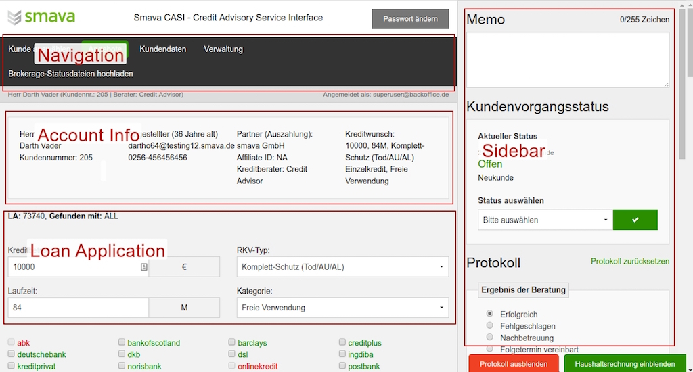

---

layout: default

style: |

    #Cover h2 {
        margin:30px 0 0;
        color:#FFF;
        text-align:center;
        font-size:70px;
        }
    #Cover p {
        margin:10px 0 0;
        text-align:center;
        color:#FFF;
        font-style:italic;
        font-size:20px;
        }
        #Cover p a {
            color:#FFF;
            }

    .slide.cover img {
        left: 50%;
        top: 50%;
        transform: translate(-50%, -50%);
    }
---

# React workshop {#Cover}

## The plan

1. React comparing with other frameworks
2. Popular recipes


## Component frameworks

1. React
2. Angular
3. Ember
4. WebComponents (Polymer)

And more

## &nbsp;
{:.cover}



## &nbsp;
{:.cover}


## Components are actually custom HTML-tags

    var MyApp = React.createClass({
        render() {
            return <div>
                <mark><LoginForm /></mark> // <-- this is component
                <input type="email"> // <-- this is just html-tag
            </div>
        }
    })

## Why not Backbone?

    var MyApp = Marionette.LayoutView.extend({
        regions: {
            <mark>login</mark>: <mark>'.login'</mark> // do not forget to add this class into template!
        },
        onRender() {
            this.<mark>login</mark>.show(new <mark>LoginForm</mark>())
        }
    })

## How to implement this?

    <div>
        <<mark>Offer</mark> data={data} />
        <<mark>Sidebar</mark> state="open">
            <<mark>Journal</mark> data={data} />
        <<mark>/Sidebar</mark>>
    </div>

## JSX

Javascript is now your template engine

    <h1>{name.toUpperCase()}</h1>
    <ul>
        {items.map(item => {
            return <li>{item.title}: {item.value}</li>
        })}
    </ul>

## What is JSX?

This is JavaScript extension, which allows you to embed HMTL

```
    var html = <div>My test content</div>
```

Actually it will be a function call

```
    var html = React.createElement('div', 'My test content')
```

## Virtual DOM

* Re-renders only that parts, that have been changed
* Detects and evaluate your custom components as well as usual html-tags
* Easy to listen to events

## React in production


## Recipies
{:.shout}

## Read and set input value

    var Form = React.createClass({
        onChange(event) {
            const val = event.target.value;
            this.setState({val: val});
        },
        render() {
            return <input value={this.state.val}
                          onChange={this.onChange}>;
        }
    });

## Routing

[React-router](https://github.com/reactjs/react-router)

    <Router>
        <IndexRoute component={IndexPage} />
        <Route path="/account/:id" component={AccountPage} />
    </Router>

## Share values between components

Use Redux:

    <mark>@Connect</mark>(state => {value: state.value})
    class PingComponent extends React.Component {}

    <mark>@Connect</mark>(state => {value: state.value})
    class PongComponent extends React.Component {}

## Global store object


## How to do ajax

Use Axios - modern Ajax library based on promises.
Server requests should happen in "actions"

    var saveAction = function(data) {
        return function(<mark>dispatch</mark>) {
            axios.post('/api/endpoint', data).then(function() {
                <mark>dispatch</mark>({type: 'SAVE_SUCCESS'})
            })
        }
    }

## We can write React components as functions

    function AccountInfo(account) {
        return <div>
            <p>Name: {account.name}</p>
            <p>Last name: {account.lastName}</p>
            <p>Amount: {account.creditAmount}</p>
            <p>Duration: {account.duration}</p>
       </div>;
    }

## Summary

* You have a state - just render it. Don't care about previous state
* Data caching for free
* If you want to do something, emit an action
* Keep your components as simple as possible

## Links

* [React tutorial](https://facebook.github.io/react/docs/tutorial.html) – getting started on official website
* [React cheat sheet](http://reactcheatsheet.com) – hints about React api
* [React-components](http://react-components.com) – a lot of ready to use UI components
* [Further reading](https://github.com/markerikson/react-redux-links)
